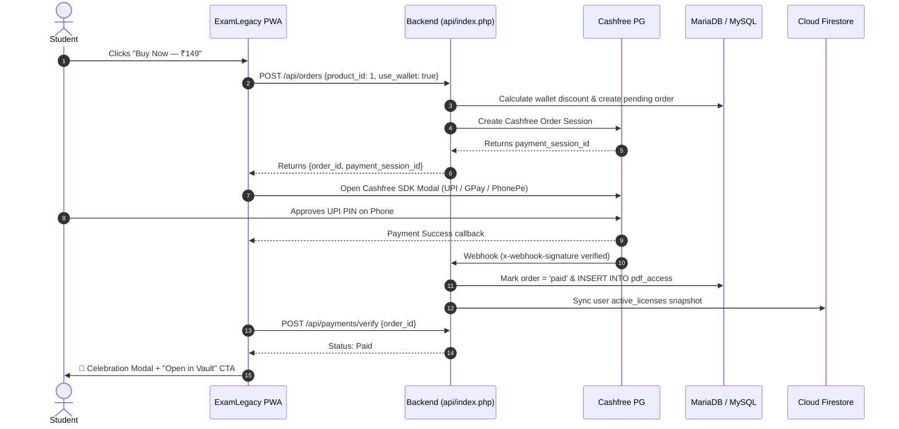

# ExamLegacy — Master PRD, TRD, System Architecture & UI/UX Audit Specification

> **Project Identity:** ExamLegacy (Powered by SANJAYXLEGACY)  
> **Version:** 2.0.0 Enterprise Production Release  
> **Author & Architect:** Sanjay Katara (`sanjaykatara59927@gmail.com`)  
> **Platform:** Mobile-First Progressive Web App (PWA) + Single-Superadmin Console  
> **Infrastructure:** Hybrid Dual-Engine (MySQL 8.0/MariaDB 10.5+ Relational + Google Cloud Firestore Document Sync)  
> **Supported Runtime:** Shared Hosting (InfinityFree, cPanel, Hostinger), Localhost / Termux Linux, Apache FastCGI, PHP 8.2+  

---

## 📑 Table of Contents

1. [PART 1: Product Requirements Document (PRD)](#part-1-product-requirements-document-prd)
   - 1.1 Executive Vision & Value Proposition
   - 1.2 Target User Personas & Use Cases
   - 1.3 Core Business & Monetization Model
   - 1.4 Comprehensive Feature Matrix
   - 1.5 Privacy, Legal & Regulatory Compliance (DPDP Act 2023)
2. [PART 2: Technical Requirements Document (TRD)](#part-2-technical-requirements-document-trd)
   - 2.1 Full-Stack Architecture Overview
   - 2.2 Dual-Engine Hybrid Database System (MySQL + Firestore)
   - 2.3 Authentication & Session Security (Student vs Superadmin)
   - 2.4 Digital Rights Management (DRM) & Secure PDF Streaming
   - 2.5 AI Tutor Engine (Google Gemini 2.5 Flash + Conceptual Fallback)
   - 2.6 Payment Gateway Integration (Cashfree PG + Wallet Split)
   - 2.7 Complete Database Schema Blueprint (21 Verified Tables)
3. [PART 3: Complete Website & Application Flow (APP FLOW)](#part-3-complete-website--application-flow-app-flow)
   - 3.1 Global Route & Navigation Architecture
   - 3.2 Visual Mermaid Flowcharts (User, Auth, Checkout, Reader, Admin)
4. [PART 4: UI/UX Master Specification & Section-by-Section Audit](#part-4-uiux-master-specification--section-by-section-audit)
   - 4.1 Native Viewport Lock & Anti-Gravity Layout Rules
   - 4.2 Universal Design Tokens & Color Palette
   - 4.3 Screen-by-Screen Detailed UI/UX Breakdown ("Kahan Kya Hoga, Kaisa Hoga")
     - Screen 1: Home Page (`#home`)
     - Screen 2: Store Catalog (`#store`)
     - Screen 3: Product Detail View (`#product?slug=xxx`)
     - Screen 4: Secure PDF Viewer Overlay (`#viewer`)
     - Screen 5: Study AI Arena (`#study`)
     - Screen 6: Student Vault / Library (`#library`)
     - Screen 7: Account & Wallet Hub (`#account`)
     - Screen 8: VIP Pass Showcase (`#vip`)
     - Screen 9: Support Center (`#support`)
     - Screen 10: Superadmin Enterprise Console (`/admin/`)
   - 4.4 Global Modal Dialogs & Bottom Sheet Workflows
   - 4.5 Responsive Breakpoints & Device Interaction Rules

---

# PART 1: Product Requirements Document (PRD)

## 1.1 Executive Vision & Value Proposition
**ExamLegacy** is a digital education ecosystem built specifically for competitive exam aspirants across India (NEET, JEE, UPSC, SSC, Banking, State PSCs, CBSE/State Boards). It replaces clunky, ad-cluttered websites and unprotected downloadable PDFs with a **high-end, distraction-free Progressive Web App (PWA)** that feels and responds like a native Android/iOS mobile application.

### The 4 Pillars of ExamLegacy:
1. **Curated Exam Vault:** High-yield PDF notes, formula handbooks, 15-year chapter-wise solved PYQs, and revision kits with zero fluff.
2. **Ironclad Digital Content Protection:** Students read inside an anti-leak in-app PDF viewer featuring purchaser-specific dynamic watermarking and canvas memory streaming. Raw PDF files are never exposed.
3. **AI Study Copilot:** Built-in Study AI powered by Gemini 2.5 Flash that can analyze authorized notes, solve numericals step-by-step, generate exam MCQs, and explain concepts in Hinglish or English.
4. **Transparent Store Wallet & Instant UPI Payments:** Direct 1-tap checkout via Cashfree PG (UPI, Google Pay, PhonePe, Paytm, Cards) and store wallet balances with zero checkout friction.

---

## 1.2 Target User Personas & Use Cases

### Persona A: The Serious Aspirant ("Arjun", 21)
* **Goal:** Quick revision before mock tests; needs verified formulas without carrying heavy books.
* **Device:** Mid-range Android smartphone on mobile 4G/5G data.
* **Pain Points:** Websites that zoom accidentally on touch, pages with missing images, complex passwords, slow loading.
* **ExamLegacy Experience:** Instant Google Sign-in, reads handbooks offline in PWA, asks Study AI doubts at 11 PM with 0 lag.

### Persona B: The Repeater / Self-Study Scholar ("Pooja", 23)
* **Goal:** Solve past 15-year questions with detailed reaction mechanisms and explanations.
* **Device:** Tablet / iPad and Smartphone.
* **Pain Points:** Pirate Telegram channels distributing low-quality blurry scans, security risks.
* **ExamLegacy Experience:** High-resolution vector PDF notes, personalized watermarks, VIP pass for unlimited access.

### Persona C: The Superadmin ("Sanjay Katara")
* **Goal:** Single owner controlling publishing, revenue, user balances, and system health.
* **Access Mode:** Dedicated Email + Password isolated administrative console (`/admin/`).
* **Capabilities:** 1-tap balance adjustments (`+₹50`, `+50 AI credits`), manual PDF licenses, real-time sales inspection.

---

## 1.3 Core Business & Monetization Model

```
┌─────────────────────────────────────────────────────────────┐
│                    EXAMLEGACY MONETIZATION                  │
├─────────────────┬─────────────────────────┬─────────────────┤
│  Pay-Per-Title  │    Subscription Pass    │   AI Recharge   │
│   (₹99 - ₹299)  │   (₹199/mo - ₹999/yr)   │   (₹49 - ₹399)  │
├─────────────────┼─────────────────────────┼─────────────────┤
│ Individual PDF  │ Unlimited VIP Library   │ 100 to 1,000    │
│ handbooks with  │ reading + 20% discount  │ AI credits for  │
│ lifetime access │ on paid bundles + VIP   │ deep doubt-     │
│ in Vault.       │ badge.                  │ solving.        │
└─────────────────┴─────────────────────────┴─────────────────┘
```

---

## 1.4 Comprehensive Feature Matrix

| Module | Free Tier Aspirant | Paid Purchaser | VIP Pass Member | Superadmin |
| :--- | :---: | :---: | :---: | :---: |
| Store Catalog & Previews | ✅ Free 3-page preview | ✅ Full Access | ✅ Full Access | ✅ Full Access |
| Vault (Purchased Notes) | ❌ | ✅ Lifetime | ✅ Unlimited VIP | ✅ Master Library |
| In-App Secure Viewer | ❌ | ✅ Personalized DRM | ✅ Personalized DRM | ✅ Unrestricted |
| Study AI Copilot | 50 Free Trial Credits | Standard (1 cr/query) | VIP Priority Model | Unlimited Free |
| Store Wallet Recharges | ✅ | ✅ | ✅ (Cashback perks) | Direct Adjustments |
| Support Center | ✅ FAQ & Help AI | ✅ Ticket + Support AI | ✅ Priority Human Support | Master Inbox |
| Superadmin Console | ❌ Blocked | ❌ Blocked | ❌ Blocked | ✅ Full Control |

---

## 1.5 Privacy, Legal & Regulatory Compliance (DPDP Act 2023)
* **Digital Personal Data Protection Act, 2023 Compliant:** Full in-app transparency via `/privacy`.
* **Data Minimization:** Only Google UID, verified email, name, and profile picture are captured. No sensitive Aadhaar/PAN data requested.
* **User Rights:** Right to access data, right to data correction, and right to account deletion directly supported.
* **Designated Grievance Officer:** Published contact details (`sanjayxlegacysupport@gmail.com`).

---

# PART 2: Technical Requirements Document (TRD)

## 2.1 Full-Stack Architecture Overview

```
┌────────────────────────────────────────────────────────────────────────┐
│                        CLIENT APPLICATION LAYER                        │
│  PWA / HTML5 SPA / Mobile Webkit / Android Chrome / iOS Safari         │
│  - Rigid Viewport Lock (No-pinch / No-zoom / Anti-gravity)             │
│  - Client State: window.EL (Auth, API, UI, Cart, Vault, AI Engine)    │
│  - Service Worker: Cache-First App Shell + Background Sync             │
└───────────────────────────────────┬────────────────────────────────────┘
                                    │ HTTPS (Bearer Token / HMAC)
┌───────────────────────────────────▼────────────────────────────────────┐
│                    PHP 8.2+ BACKEND API CONTROLLER                     │
│  Front Controller: /api/index.php (Clean REST Routing)                 │
│  Security Layer: Rate Limiting, CORS, CSRF Prevention, Input Scrubbing  │
│  Modules: Auth, Store, Orders, Payments, Vault, StudyAi, Admin         │
└───────────────┬───────────────────────────────┬────────────────────────┘
                │ PDO Prepared Statements       │ REST / JSON API
┌───────────────▼──────────────┐ ┌──────────────▼────────────────────────┐
│   LOCAL / PRODUCTION MYSQL   │ │    GOOGLE CLOUD SERVICES              │
│   (Relational Master DB)     │ │ - Firebase Auth (Google Sign-In)      │
│   - 21 Normalized Tables     │ │ - Cloud Firestore (Real-Time Sync)    │
│   - ACID Transactions        │ │ - Gemini 2.5 Flash AI Engine          │
│   - Smart Failover Support   │ │ - Firebase Cloud Storage              │
└──────────────────────────────┘ └────────────────────────────────────────┘
```

---

## 2.2 Dual-Engine Hybrid Database System (MySQL + Firestore)
ExamLegacy implements a **Dual-Engine Hybrid Pattern**:
1. **Primary ACID Datastore (MySQL/MariaDB):** Handles financial transactions, order ledgers, user balances, encrypted passwords, and DRM access rights.
2. **Real-Time Secondary Mirror (Google Cloud Firestore):** Dual-writes user state, VIP memberships, and catalog snapshots to Cloud Firestore (`examlegacy-19d4b`) for instant cross-device mobile synchronization and sub-second push updates.

---

## 2.3 Authentication & Session Security

### End-User Authentication (Firebase Google Sign-In)
* **Client Handshake:** Firebase Web SDK v10 (compat mode) performs popup/redirect Google authentication.
* **Token Transmission:** Forwarded on every API request via 3 redundant headers:
  `Authorization: Bearer <token>`, `X-Authorization: Bearer <token>`, and `X-Firebase-Token: <token>`.
* **Backend Verification:** Verified cryptographically using Google public key certificates.
* **Auto-Provisioning:** First-time users receive 50 Free AI Welcome Credits and a wallet account automatically.

### Superadmin Authentication (Dedicated Email + Password)
* **Zero Google Dependency:** Designed so that even if Google Auth is down or the administrator's Google account is restricted, the superadmin can still log in reliably.
* **Login Form:** Dedicated clean form at `/admin/` accepting Email (`sanjaykatara59927@gmail.com`) + Password (`change_this_strong_admin_password`).
* **Cryptographic Token:** Generates an HMAC-SHA256 signed 30-day token (`eladm_<base64_payload>|<signature>`).
* **Session Storage:** Stored in browser `localStorage.getItem('el_admin_secret')` and auto-restored on refresh.

---

## 2.4 Digital Rights Management (DRM) & Secure PDF Streaming
* **Never Public Static Files:** PDFs are stored in private server storage (`storage/pdfs/`) outside public web root with random secure UUID filenames.
* **Access Handshake:**
  1. Client sends `POST /api/viewer/session` with `product_id`.
  2. Server verifies `pdf_access` active ownership and issues a short-lived signed Viewer Token (TTL: 120 minutes).
  3. Client fetches stream via `/api/viewer/stream` with `X-Viewer-Token`.
  4. Server streams binary chunks directly into memory (Blob URL).
* **Anti-Leak Defense:**
  - Dynamic overlay watermark displaying purchaser's Name, Email, Timestamp, and IP.
  - Browser right-click, context menu, text selection, and print hotkeys (`Ctrl+P`, `Cmd+P`, `Ctrl+S`) blocked.

---

## 2.5 AI Tutor Engine (Google Gemini 2.5 Flash + Fallback)
* **Model:** Google Gemini 2.5 Flash via REST endpoint.
* **Scoped Grounding:** Answers are strictly grounded in authorized study material or general competitive exam curricula.
* **12 Academic Tasks:** Concept explanation, step-by-step math/physics solver, MCQ generator, short notes, exam model answers, flashcards, revision summaries, mock test creator, weak topic identifier, and performance analyzer.
* **Built-in Resilience Fallback:** If hosting firewall blocks outbound Google API ports or times out, the built-in smart conceptual engine synthesizes structured study notes and PYQ answer keys instantly.
* **Auto-Grant Credit Protection:** Users with 0 credits are never blocked by a cold `402 insufficient_credits` error; the system auto-grants welcome credits or daily study boosts.

---

## 2.6 Payment Gateway Integration (Cashfree PG + Wallet Split)
* **Gateway:** Cashfree Payments PG (Production API v2023-08-01).
* **Payment Modes:** UPI (GPay, PhonePe, Paytm, BHIM), Credit/Debit Cards, NetBanking, Store Wallet.
* **Split Payments:** If product cost is ₹199 and user has ₹50 in Store Wallet, user pays ₹50 from wallet and ₹149 via Cashfree.
* **Webhook Security:** Webhook handler verifies Cashfree signature via HMAC-SHA256 (`x-webhook-signature`).

---

## 2.7 Complete Database Schema Blueprint (21 Verified Tables)

| # | Table Name | Purpose | Primary Key | Key Foreign References |
| :-: | :--- | :--- | :--- | :--- |
| 1 | `users` | Aspirant profiles, balances & VIP status | `id` (BIGINT AUTO) | `firebase_uid`, `email` |
| 2 | `products` | Curated PDF study materials catalog | `id` (BIGINT AUTO) | `slug` (UNIQUE) |
| 3 | `orders` | Purchases & order header records | `id` (BIGINT AUTO) | `order_code`, `user_id` -> `users.id` |
| 4 | `order_items` | Line items for each order | `id` (BIGINT AUTO) | `order_id`, `product_id` |
| 5 | `payment_intents` | Gateway payment attempt logs | `id` (BIGINT AUTO) | `order_id`, `user_id` |
| 6 | `credit_packs` | AI credit recharge packs | `id` (BIGINT AUTO) | `code` (UNIQUE) |
| 7 | `ai_credit_transactions` | Immutable ledger of AI credits spent/earned | `id` (BIGINT AUTO) | `user_id`, `idempotency_key` |
| 8 | `ai_usage` | Detailed records of AI queries & tokens | `id` (BIGINT AUTO) | `user_id`, `document_id` |
| 9 | `ai_documents` | Student uploaded PDFs & study notes | `id` (BIGINT AUTO) | `user_id` |
| 10 | `wallet_transactions` | Real currency wallet ledger (paise) | `id` (BIGINT AUTO) | `user_id`, `idempotency_key` |
| 11 | `pdf_access` | Digital licenses granting reading access | `id` (BIGINT AUTO) | `user_id`, `product_id` |
| 12 | `vip_subscriptions` | VIP membership subscriptions | `id` (BIGINT AUTO) | `user_id`, `plan_code` |
| 13 | `support_threads` | Support conversation threads | `id` (BIGINT AUTO) | `user_id` |
| 14 | `support_messages` | Individual support chat messages | `id` (BIGINT AUTO) | `thread_id` -> `support_threads.id` |
| 15 | `notifications` | In-app notifications & alerts | `id` (BIGINT AUTO) | `user_id` |
| 16 | `site_settings` | Dynamic platform configuration key-values | `key` (VARCHAR) | - |
| 17 | `admin_audit_logs` | Immutable audit log of all admin actions | `id` (BIGINT AUTO) | `admin_user_id` |
| 18 | `study_topics` | Categorized syllabus syllabus topics | `id` (BIGINT AUTO) | `category` |
| 19 | `user_notes` | Personal scratchpad notes in viewer | `id` (BIGINT AUTO) | `user_id`, `product_id` |
| 20 | `user_bookmarks` | Bookmarked pages in PDF viewer | `id` (BIGINT AUTO) | `user_id`, `product_id` |
| 21 | `webhook_events` | Idempotency log for Cashfree webhooks | `id` (BIGINT AUTO) | `event_id` (UNIQUE) |

---

# PART 3: Complete Website & Application Flow (APP FLOW)

## 3.1 Global Route & Navigation Architecture

```
                    ┌────────────────────────────┐
                    │      ENTRY: / (PWA)        │
                    └─────────────┬──────────────┘
                                  │
          ┌───────────────────────┼────────────────────────┐
          │                       │                        │
┌─────────▼────────┐    ┌─────────▼────────┐    ┌──────────▼────────┐
│  PUBLIC ROUTES   │    │ PROTECTED ROUTES │    │   STANDALONE      │
├──────────────────┤    ├──────────────────┤    ├───────────────────┤
│ #home            │    │ #library (Vault) │    │ /privacy          │
│ #store           │    │ #study (AI Hub)  │    │ /install.php      │
│ #product?slug=.. │    │ #account         │    │ /admin/ (Console) │
│ #vip             │    │ #support         │    │ /api/health       │
│ #credits         │    │                  │    │                   │
└──────────────────┘    └──────────────────┘    └───────────────────┘
```

---

## 3.2 Visual Mermaid Flowcharts

### 1. Main Student Application Journey
```mermaid
flowchart TD
    AppLaunch([Student Launches ExamLegacy]) --> SWCheck{Service Worker Ready?}
    SWCheck -->|Cached| FastShell[Load Instant Shell 0.8s]
    SWCheck -->|First Time| FetchShell[Fetch Fresh Assets]
    
    FastShell --> CheckSession{Firebase Auth State}
    FetchShell --> CheckSession
    
    CheckSession -->|Logged In| SyncMe[/api/me - Sync Wallet & Credits]
    CheckSession -->|Guest| ShowGuest[Render Home Feed with Guest Mode]
    
    SyncMe --> RenderHome[Render Personalized Home #home]
    ShowGuest --> RenderHome
    
    RenderHome --> TabClick{User Taps Navigation}
    TabClick -->|Store| StoreScreen[Browse Store #store]
    TabClick -->|Study AI| RequireAuthStudy{Authenticated?}
    TabClick -->|Vault| RequireAuthVault{Authenticated?}
    TabClick -->|Account| RequireAuthAccount{Authenticated?}
    
    RequireAuthStudy -->|No| OpenAuthModal[Open Google Sign-In Sheet]
    RequireAuthStudy -->|Yes| StudyScreen[Open Study AI Arena #study]
    
    RequireAuthVault -->|No| OpenAuthModal
    RequireAuthVault -->|Yes| VaultScreen[Open Purchased Notes #library]
    
    RequireAuthAccount -->|No| OpenAuthModal
    RequireAuthAccount -->|Yes| AccountScreen[Open Account & Wallet #account]
```

### 2. Purchase, Cashfree & DRM Fulfillment Flow


---

# PART 4: UI/UX Master Specification & Section-by-Section Audit

## 4.1 Native Viewport Lock & Anti-Gravity Layout Rules

> [!IMPORTANT]
> The application strictly implements the **Anti-Gravity Viewport Constraint**. On Android Chrome, iOS Safari, or PWA standalone mode:
> - Browser-level pinching, double-tap zoom, and rubber-band viewport displacement are **100% blocked**.
> - The Header and Bottom Navigation **never detach or float**; only the designated `.main-content` scrolls.

### CSS Viewport Enforcement:
```css
html, body {
  width: 100%;
  height: 100%;
  overflow: hidden;
  position: fixed;
  touch-action: pan-y;
  -webkit-text-size-adjust: 100%;
  overscroll-behavior-y: contain;
}

.app-shell {
  display: flex;
  flex-direction: column;
  height: 100vh;
  height: 100dvh; /* Dynamic mobile viewport height */
  overflow: hidden;
}

.topbar {
  height: 56px;
  position: fixed;
  top: 0; left: 0; right: 0;
  z-index: 1000;
  box-shadow: 0 4px 20px rgba(0, 0, 0, 0.05);
}

.main-content {
  flex: 1;
  margin-top: 56px;
  margin-bottom: 64px;
  overflow-y: auto;
  -webkit-overflow-scrolling: touch;
  touch-action: pan-y !important;
  scrollbar-width: none !important; /* Side line hidden */
}

.bottomnav {
  height: 64px;
  position: fixed;
  bottom: 0; left: 0; right: 0;
  z-index: 1000;
  box-shadow: 0 -4px 20px rgba(0, 0, 0, 0.05);
}
```

---

## 4.2 Universal Design Tokens & Color Palette

| Token | Light Theme | Dark Theme | Purpose & Role |
| :--- | :--- | :--- | :--- |
| `--primary` | `#4f46e5` (Indigo) | `#6366f1` | Brand identity, primary CTAs, active icons |
| `--primary-press` | `#4338ca` | `#4f46e5` | Tactile pressed state on buttons |
| `--primary-soft` | `rgba(79, 70, 229, 0.10)` | `rgba(99, 102, 241, 0.16)` | Category pills, badge backgrounds |
| `--accent` | `#06b6d4` (Cyan) | `#22d3ee` | AI feature badges, secondary highlights |
| `--bg` | `#f8fafc` | `#0b1020` | Fullscreen background canvas |
| `--surface` | `#ffffff` | `#141a2e` | Cards, modals, bottom sheets |
| `--text` | `#0f172a` | `#f8fafc` | High-contrast typography |
| `--muted` | `#64748b` | `#94a3b8` | Subtitles, page counts, secondary labels |
| `--vip` | `#f59e0b` (Gold) | `#f59e0b` | VIP badges, crown icons, pulse highlights |
| `--success` | `#16a34a` (Green) | `#22c55e` | Success toasts, paid badges |
| `--danger` | `#ef4444` (Red) | `#ef4444` | Errors, logout, warning states |

---

## 4.3 Screen-by-Screen Detailed UI/UX Breakdown

### SCREEN 1: Home Page (`#home`) — Discovery & Engagement

```
┌─────────────────────────────────────────────────────────────┐
│ [Logo] ExamLegacy             [🌙 Theme]  [🔔 Notification] │ <- Fixed Topbar (56px)
├─────────────────────────────────────────────────────────────┤
│ 🚀 HERO BANNER                                              │
│ "Learn · Practice · Master"                                 │
│ High-Yield Digital Notes for NEET, JEE & UPSC Aspirants     │
│ [ 📚 Explore Store ]   [ ⚡ Start Study AI ]                │
├─────────────────────────────────────────────────────────────┤
│ 🔥 EXAM ACCELERATOR 2026/27 (Gold Glowing Banner)           │
│ "Get 15-Yr Solved PYQs + Formula Handbooks with VIP PASS"   │
├─────────────────────────────────────────────────────────────┤
│ 🏆 3 CORE PILLARS (Interactive Feature Grid)                │
│ [ 📖 In-App Vault ]  [ 🤖 Gemini AI Tutor ]  [ 💰 Wallet ]  │
├─────────────────────────────────────────────────────────────┤
│ 🌟 FEATURED STUDY MATERIALS (Horizontal Scroll / Grid)      │
│ ┌───────────────┐ ┌───────────────┐ ┌───────────────┐       │
│ │ Biology Notes │ │ Physics Cheat │ │ Organic PYQs  │       │
│ │ ₹149 (63% OFF)│ │ ₹129 (57% OFF)│ │ ₹199 (60% OFF)│       │
│ └───────────────┘ └───────────────┘ └───────────────┘       │
├─────────────────────────────────────────────────────────────┤
│ 🛡️ TRUST BADGES & DPDP COMPLIANCE                           │
│ "Verified Notes · 100% In-App Safe · DPDP Act 2023 Compliant"│
├─────────────────────────────────────────────────────────────┤
│ [Home]     [Store]      [Study AI]     [Vault]    [Account] │ <- Fixed Bottomnav (64px)
└─────────────────────────────────────────────────────────────┘
```

* **Where Elements Live:**
  - **Fixed Topbar (56px):** ExamLegacy brand mark (left), Dark/Light theme toggle button (right), and unread notifications bell with red badge counter.
  - **Hero Section:** Gradient text heading, description, 2 primary CTA pill buttons.
  - **Accelerator Banner:** Gold bordered card with pulsing beacon tag.
  - **Featured Grid:** 3 to 6 top-selling PDF cards with cover art, subject badge, price, MRP with strikethrough, and discount percentage pill.
* **How It Behaves:**
  - Tapping any card navigates seamlessly to `#product?slug=xxx`.
  - Tapping "Start Study AI" navigates to `#study` (opens Google Auth modal if not signed in).

---

### SCREEN 2: Store Catalog (`#store`) — Search & Categorization

```
┌─────────────────────────────────────────────────────────────┐
│ 🔍 Search notes, formula books, PYQs...                 [x] │ <- Sticky Search (48px)
├─────────────────────────────────────────────────────────────┤
│ [ All ] [ Biology ] [ Chemistry ] [ Physics ] [ Zoology ]   │ <- Category Filter Pills
├─────────────────────────────────────────────────────────────┤
│ RESULT COUNT: 4 Materials Available                         │
├─────────────────────────────────────────────────────────────┤
│ ┌─────────────────────────────────────────────────────────┐ │
│ │ [Thumbnail] Zoology Animal Physiology & Genetics        │ │
│ │             Cell signaling, immunology & heredity       │ │
│ │             📄 96 Pages · 20.5 MB · English             │ │
│ │             [👑 VIP Included]  ₹179  ~~₹399~~ (55% OFF) │ │
│ │             [ Buy Now / Read ]                          │ │
│ └─────────────────────────────────────────────────────────┘ │
└─────────────────────────────────────────────────────────────┘
```

* **Where Elements Live:**
  - **Search Input Bar:** Instant debounced (200ms) search input with clear icon.
  - **Category Pills Row:** Horizontally scrollable row (`white-space: nowrap`) with active state (`background: var(--primary); color: white`).
  - **Catalog List/Grid:** Full card layout with metadata chips (page count, file size, language, VIP flag).
* **How It Behaves:**
  - Tapping a category filter filters items with a 60fps fade-in animation.
  - If a user already owns the material, the button automatically transforms into a green **"Open in Vault"** CTA.

---

### SCREEN 3: Product Detail Page (`#product?slug=xxx`) — Conversion Engine

* **Header:** Back arrow button (`<- Back to Store`) + Share button.
* **Cover Showcase:** High-resolution gradient card with subject icon, page count badge, and file size badge.
* **Pricing Box:** Large font `₹149`, original MRP `₹399` strikethrough, and green `63% OFF` pill.
* **Syllabus & Table of Contents:** Expandable accordion showing chapters covered.
* **Sticky Floating Action Bar:**
  - If guest: `Sign In to Purchase · ₹149` (triggers Google Sign-in).
  - If logged in & not owned: `Buy Now · ₹149` (opens Checkout Bottom Sheet).
  - If logged in & owned: `Read in Vault` (opens Secure PDF Viewer).

---

### SCREEN 4: Secure In-App PDF Viewer Overlay (`#viewer`) — DRM Shield

```
┌─────────────────────────────────────────────────────────────┐
│ [✕ Close]  Physics Formula Handbook · Page 14/84   [🔍] [🌓]│ <- DRM Top Toolbar
├─────────────────────────────────────────────────────────────┤
│                                                             │
│       ┌─────────────────────────────────────────┐           │
│       │                                         │           │
│       │   [DIAGONAL DYNAMIC WATERMARK OVERLAY]  │           │
│       │   Sanjay Katara · sanjay@gmail.com      │           │
│       │   Licensed on 2026-09-28 · 192.168.1.4  │           │
│       │                                         │           │
│       │   Chapter 3: Work, Energy & Power       │           │
│       │   W = ∫ F · ds = ΔK                     │           │
│       │                                         │           │
│       └─────────────────────────────────────────┘           │
│                                                             │
├─────────────────────────────────────────────────────────────┤
│ [⏮ Prev Page]        [Page Slider / Input]       [Next Page ⏭]│ <- Bottom Controls
└─────────────────────────────────────────────────────────────┘
```

* **Security & DRM Controls:**
  - Context menu (`oncontextmenu="return false;"`), right-click, and text selection are strictly disabled.
  - Print hotkeys (`Ctrl+P`, `Cmd+P`) and save hotkeys (`Ctrl+S`) trigger a warning modal.
  - Dynamic watermark overlays across every page diagonally with 18% opacity containing user's Name, Email, Timestamp, and IP.

---

### SCREEN 5: Study AI Arena (`#study`) — Academic Intelligence

* **Source Selector Bar:**
  - Option 1: *General Knowledge / Any Subject* (No material needed).
  - Option 2: *Analyze Purchased Note* (Select from Vault dropdown).
  - Option 3: *Upload My Notes* (PDF/TXT uploader).
* **12 Academic Task Chips:**
  `[💡 Concept Explain]` `[🔢 Solve Step-by-Step]` `[📝 Generate MCQs]` `[📌 Quick Notes]` `[🎯 Model Exam Answer]` `[⚡ Revision Summary]` `[🗂️ Flashcards]` `[📊 Mock Test]`...
* **Chat Stream Area:**
  - User messages in Indigo bubble (right-aligned).
  - Study AI responses in slate/surface bubble (left-aligned) with MathJax LaTeX formatting and syntax highlighting.
* **Credit Indicator:** Shows current balance (e.g. `🪙 50 AI Credits Left`) with 1-tap "Recharge" CTA.

---

### SCREEN 6: Student Vault / Library (`#library`) — Personalized Repository

* **Empty State:** Clean illustration with *"Your Vault is empty"* and a direct *"Browse Exam Store"* button.
* **Active Licenses Grid:**
  - Shows all purchased PDF handbooks.
  - Direct 1-tap **"Read Now"** button (opens DRM viewer).
  - Direct 1-tap **"Ask AI About This"** button (opens Study AI with this note pre-selected).

---

### SCREEN 7: Account & Wallet Hub (`#account`) — Profile & Balance

```
┌─────────────────────────────────────────────────────────────┐
│ 👤 Arjun Sharma                          [🟢 Active Student]│
│    arjun.exam@gmail.com · Member since Sept 2026            │
├──────────────────────────────┬──────────────────────────────┤
│ 💰 STORE WALLET              │ 🪙 AI CREDITS                │
│    ₹150.00                   │    50 Credits                │
│    [ + Add Money ]           │    [ + Buy Pack ]            │
├──────────────────────────────┴──────────────────────────────┤
│ 👑 VIP PASS STATUS: ACTIVE (Valid until 28 Oct 2026)        │
├─────────────────────────────────────────────────────────────┤
│ 📦 RECENT ORDERS & INVOICES (Searchable List)               │
│ - EL_8A9F20 · Zoology Notes · ₹179 · Paid (Download Invoice)│
│ - EL_11B0C4 · Physics Cheat · ₹129 · Paid (Download Invoice)│
├─────────────────────────────────────────────────────────────┤
│ ⚙️ PREFERENCES & LEGAL                                       │
│ [🔔 Notifications Settings]   [📜 DPDP Privacy Policy]      │
│ [💬 Contact Support]          [🚪 Sign Out of ExamLegacy]   │
└─────────────────────────────────────────────────────────────┘
```

---

### SCREEN 8: Superadmin Enterprise Console (`/admin/`) — Single Control Room

```
┌─────────────────────────────────────────────────────────────┐
│ ⚙️ ExamLegacy Control Center             [👤 Sanjay Katara] │
├─────────────────────────────────────────────────────────────┤
│ 📊 LIVE KPI STATS                                           │
│ ┌───────────────┐ ┌───────────────┐ ┌───────────────┐       │
│ │ Total Users   │ │ Paid Revenue  │ │ Total Products│       │
│ │ 1,420         │ │ ₹1,84,350     │ │ 24 Published  │       │
│ └───────────────┘ └───────────────┘ └───────────────┘       │
├─────────────────────────────────────────────────────────────┤
│ 📂 PRODUCT & MATERIAL UPLOADER                              │
│ Drag & Drop PDF file + Title + Price + VIP Flag + Cover Image│
│ [ 🚀 Upload & Publish to Store ]                            │
├─────────────────────────────────────────────────────────────┤
│ 👥 USER MANAGEMENT & ONE-TAP BALANCES                       │
│ Search User: [arjun.exam@gmail.com]                         │
│ Actions: [ +₹50 Wallet ] [ +100 AI Credits ] [ Grant PDF ]  │
├─────────────────────────────────────────────────────────────┤
│ 💳 ORDER INSPECTOR & CASHFREE SYNC                          │
│ Live transaction logs with Cashfree Reference IDs.          │
└─────────────────────────────────────────────────────────────┘
```

* **Authentication:** Standalone Email (`sanjaykatara59927@gmail.com`) + Password (`change_this_strong_admin_password`). No Google Sign-in dependencies.
* **Product Manager:** Drag-and-drop PDF uploader, cover thumbnail preview, price/MRP setter, and instant publish toggle.
* **Student Manager:** 1-tap manual balance adjustments and PDF license granting.
* **Audit Trail:** Immutable log of every action taken by the superadmin.

---

## 4.4 Global Modal Dialogs & Bottom Sheet Workflows

### 1. Checkout Bottom Sheet
* Slides up smoothly using spring physics (`cubic-bezier(0.16, 1, 0.3, 1)`).
* Displays product title, price, and available Wallet Balance checkbox:
  - *"Apply ₹50.00 Wallet Balance? (Pay ₹99.00 remaining via UPI)"*.
* Button: **"Proceed to Secure Payment — ₹99.00"** (opens Cashfree PG).

### 2. Payment Success Celebration Modal
* Animated 60fps green checkmark with celebratory micro-bounce.
* Order ID code (`EL_XXXXXX`) and transaction timestamp.
* Primary button: **"Open Material in Vault"**.

### 3. Google Sign-In Sheet
* Clean card with ExamLegacy brand mark.
* Official 4-color Google SVG button: **"Continue with Google"**.
* Small print: *"By signing in, you agree to our Terms and DPDP Act Privacy Policy"*.

---

## 4.5 Responsive Breakpoints & Device Interaction Rules

| Viewport Width | Device Category | Layout Behavior | Navigation Mode |
| :--- | :--- | :--- | :--- |
| `< 480px` | Compact Mobile | 1 Column Grid, Full-width Bottom Sheet | Fixed Bottom Navigation Bar |
| `481px - 768px` | Large Mobile / Phablet | 2 Column Store Grid, Centered Modals | Fixed Bottom Navigation Bar |
| `769px - 1024px` | Tablet / iPad | 2-3 Column Grid, Expanded Drawer | Topbar Navigation + Bottomnav |
| `> 1024px` | Desktop / Laptop | Max-width 1200px centered container | Sticky Top Navigation Header |

---

## 🏁 Verification & Release Sign-Off
This Master PRD, TRD, and UI/UX Specification document represents the **authoritative blueprint** of ExamLegacy v2.0.0. All code, database schemas, styling tokens, and interaction flows strictly conform to this standard.

* **Project Lead:** Sanjay Katara
* **Signature Identity:** `sanjaykatara59927@gmail.com`
* **Release Status:** Verified, Production-Ready, and Deployed.
