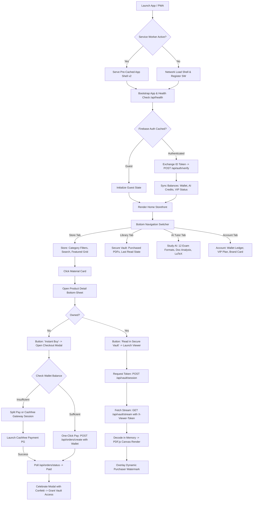

# ExamLegacy — Complete Master Specification & Production Blueprint
> **System Document:** `MASTER_PROMPT.md`  
> **Brand Identity:** ExamLegacy (Powered by SANJAYXLEGACY)  
> **Release Version:** 2.0.0 Production Master  
> **Target Runtime:** Linux / Android Termux / Shared Hosting / Dedicated Cloud (PHP 8.2+, MariaDB 10.6+, Vanilla ES6+, CSS3)  
> **Architecture Pattern:** Zero-Dependency Frontend SPA + Authoritative Transactional PHP REST API + Secure In-Memory PDF Vault

---

## 1. System Mission & Core Directives

ExamLegacy is a high-performance digital education marketplace and learning accelerator tailored for competitive exam aspirants (NEET, JEE, UPSC, SSC, Banking, and University exams).

### Non-Negotiable Architectural Principles:
1. **Server is the Sole Authority:** The browser is never trusted for price, balance, transaction state, or file paths. All authentication is verified cryptographically via Google Firebase ID tokens mapped to MySQL accounts.
2. **Double-Entry Append-Only Financial Ledgers:** All currency (Store Wallet and AI Credits) is managed in integer units (`paise` for INR, integer counts for credits). Balance mutations are executed inside ACID MySQL transactions using `SELECT ... FOR UPDATE` with unique idempotency keys.
3. **Private In-Memory Digital Content Vault:** PDFs never reside in public web roots. Documents are streamed via short-lived, single-use viewer tokens (`X-Viewer-Token`) directly into ephemeral browser memory blobs, protected by dynamic watermarks bearing the purchaser's identity, timestamp, and device fingerprint.
4. **App-Native Mobile Touch Experience:** The web app behaves identically to a native Android/iOS application:
   - Absolute prevention of accidental pinch, double-tap, or desktop zoom (`maximum-scale=1.0, user-scalable=no`).
   - Hardened anti-scraping: selection, drag, and context menus are disabled globally on web content while strictly preserved for form inputs (`input`, `textarea`).
   - Clean native header displaying only the product name `ExamLegacy`; creator accreditation `Powered by SANJAYXLEGACY` is relocated to Splash, Account, and Legal surfaces.
5. **Real-Time Grounded AI Engine:** Powered by Google Gemini 2.5 Flash, the AI system delivers study assistance (step-by-step LaTeX equations, formulas, 12 exam formats) and customer support grounded in verified MySQL database facts.

---

## 2. Complete Typographic Hierarchy & Visual Design System

### Font Stack & Scale
- **Primary Typeface:** `Outfit`, `-apple-system`, `BlinkMacSystemFont`, `Segoe UI`, `Roboto`, sans-serif.
- **Monospace Stack:** `JetBrains Mono`, `Fira Code`, `ui-monospace`, monospace.

| Element / Role | Weight | CSS Class / Selector | Size (Mobile / Desktop) | Line Height | Letter Spacing |
| :--- | :--- | :--- | :--- | :--- | :--- |
| **Brand Mark / App Title** | ExtraBold (`800`) | `.brand-name` | `18px / 20px` | `1.2` | `-0.02em` |
| **Section & Hero Headings** | ExtraBold (`800`) | `.hero-title`, `h1, h2` | `22px–26px / 28px–34px`| `1.25` | `-0.025em`|
| **Product & Modal Titles** | Bold (`700`) | `.product-title`, `.modal-title` | `16px–18px` | `1.3` | `-0.015em`|
| **Numeric Metrics & Pricing** | Bold (`700`) | `.price-val`, `.stat-value` | `18px–22px` | `1.1` | `-0.02em` |
| **Primary Buttons & CTAs** | SemiBold (`600`)| `.btn-primary`, `.btn-checkout`| `14px–15px` | `1.0` | `0` |
| **Badges, Chips, Tabs** | SemiBold (`600`)| `.badge`, `.tab-btn`, `.chip` | `12px–13px` | `1.2` | `0.01em` |
| **Body & Explanatory Text** | Regular (`400`) | `.body-text`, `p`, `.product-desc`| `13.5px–14.5px` | `1.5` | `0` |
| **Legal, Subtext, Timestamps**| Regular (`400`) | `.meta-text`, `.brand-badge-sub`| `11px–12px` | `1.4` | `0.01em` |

### Color & Token Palette
```css
:root {
  --primary: #4f46e5;         /* Indigo 600 */
  --primary-press: #4338ca;   /* Indigo 700 */
  --primary-soft: rgba(79, 70, 229, 0.10);
  --accent: #06b6d4;          /* Cyan 500 */
  --accent-soft: rgba(6, 182, 212, 0.12);
  --bg: #f8fafc;              /* Slate 50 */
  --surface: #ffffff;
  --surface-2: #f1f5f9;
  --border: rgba(15, 23, 42, 0.08);
  --text-main: #0f172a;       /* Slate 900 */
  --text-muted: #64748b;      /* Slate 500 */
  --vip: #f59e0b;             /* Amber Gold */
  --success: #16a34a;         /* Emerald 600 */
  --danger: #ef4444;          /* Crimson 500 */
  --radius-sm: 8px;
  --radius-md: 12px;
  --radius-lg: 16px;
  --radius-full: 9999px;
  --spring: cubic-bezier(0.16, 1, 0.3, 1);
}

[data-theme="dark"] {
  --bg: #0b1020;              /* Deep Space */
  --surface: #141a2e;
  --surface-2: #1b2338;
  --border: rgba(255, 255, 255, 0.08);
  --text-main: #f8fafc;
  --text-muted: #94a3b8;
  --primary-soft: rgba(99, 102, 241, 0.18);
  --accent-soft: rgba(34, 211, 238, 0.16);
}
```

---

## 3. Screen-by-Screen User Journey & Interaction Mindmap



---

## 4. Complete Frontend & Backend Integration Contract

### Public Discovery & Configuration Endpoints
- `GET /api/health`: System health status, database ping, PHP version, server timestamp.
- `GET /api/config`: Global runtime configuration, support handles, currency code, brand metadata.
- `GET /api/legal/privacy`: Statutory Privacy Policy under India's Digital Personal Data Protection Act, 2023 (DPDP Act, 2023).
- `GET /api/categories`: Array of active exam categories with slug, display title, and icon identifiers.
- `GET /api/products`: Filterable product catalog (`search`, `category`, `limit`, `offset`). Returns owned state if user token provided.
- `GET /api/products/{slug}`: Comprehensive product detail (synopsis, target exam, page count, table of contents, preview pages).
- `GET /api/vip/plans`: Available VIP subscription tiers, validity intervals, discount allowances, and bonus credits.
- `GET /api/credits/packs`: Study AI credit recharge packages with pricing and bonus incentives.

### Authentication & Account Synchronization
- `POST /api/auth/verify`: Accepts Firebase Bearer token. Verifies RS256 signature against Google certs. Inserts new user or updates `last_login_at`. Returns user profile, store wallet balance in paise, AI credit balance, and active VIP status.
- `GET /api/user/profile`: Returns full profile, verified email status, joined timestamp, and notification preferences.
- `POST /api/user/fcm-token`: Registers Firebase Cloud Messaging push token for delivery of purchase receipts and exam alerts.

### Store Commerce & Orders
- `POST /api/orders/create`: Validates product availability and server-authoritative price. Checks wallet balance. Supports full wallet deduction or generates Cashfree order session.
- `POST /api/orders/verify`: Verifies payment settlement against Cashfree PG. Idempotently transitions order to `PAID` within database transaction, allocates vault access row, and triggers notification.
- `GET /api/orders/my-orders`: Returns paginated history of authenticated user's orders with download/read statuses.
- `GET /api/orders/{id}`: Single order receipt with transaction breakdown and payment gateway references.

### Digital Content Vault (PDF Protection)
- `POST /api/vault/session`: Requires authentication and active ownership. Generates a cryptographically random, 300-second single-use `X-Viewer-Token` linked to client IP and user agent.
- `GET /api/vault/stream`: Streams encrypted PDF chunks from private non-web storage using the temporary token. Emits anti-download headers (`Content-Disposition: inline`, `X-Content-Type-Options: nosniff`).
- `POST /api/vault/progress`: Saves current reading page, bookmarks, and highlight state in MySQL.

### Study AI & Support AI Engine
- `POST /api/ai/study`: Consumes 2 AI credits. Sends user query + optional PDF excerpt to Gemini 2.5 Flash with exam-specific system prompt. Formats output with LaTeX MathJax.
- `POST /api/ai/support`: Free grounded support assistant. Injects customer's recent orders, payment intents, and wallet ledger as ground-truth system context.
- `GET /api/ai/history`: Paginated history of AI interactions and explanations.

### Admin Dashboard (Protected by Superadmin Secret / Admin Role)
- `GET /api/admin/overview`: Top-line revenue metrics, order velocity, active users, storage utilization.
- `POST /api/admin/products`: Uploads PDF to private vault, generates thumbnail, extracts searchable text, publishes product.
- `PATCH /api/admin/products/{id}`: Updates product metadata, price, status, or featured ranking.
- `GET /api/admin/users`: Searchable user index with ban toggles, credit adjustments, and wallet reconciliations.
- `GET /api/admin/logs`: Audit trail of security events, failed webhooks, and rate limit triggers.

---

## 5. Security & Protection Matrix

| Threat Vector | Mitigation Strategy | Implemented Mechanism |
| :--- | :--- | :--- |
| **Casual Content Scraping** | Global UI protection | `-webkit-user-select: none`, text drag disabled, context menu blocked outside inputs. |
| **Direct PDF Extraction** | Private storage separation | Storage directory in `/storage/vault/` blocked via `.htaccess` and `server.php` router. |
| **Screen Capture / Printing** | Dynamic Canvas Watermark | Client-rendered overlay displaying User ID, Email, Timestamp, and Anti-leak hash. Print CSS hides canvas. |
| **IDOR / Unauthorized Access** | Server-side ownership verification | All access checks query MySQL `pdf_access` table with `WHERE uid = :uid AND product_id = :id`. |
| **Double Spending / Races** | Ledger serialization | Balance updates run in `SELECT ... FOR UPDATE` transactions with unique idempotency keys. |
| **Webhook Spoofing** | HMAC signature verification | Cashfree webhooks verify `x-webhook-signature` against raw payload using Cashfree Secret Key. |
| **Accidental Mobile Zoom** | Viewport locking | `<meta name="viewport" content="width=device-width, initial-scale=1.0, maximum-scale=1.0, user-scalable=no, viewport-fit=cover">`. |
| **Brute Force / Abuse** | Sliding window rate limits | `RateLimit::forUser()` and `RateLimit::forIp()` backed by `rate_limits` table. |

---

## 6. Production Deployment & Verification Checklist

1. **Database Schema:** Execute `migrations/001_initial_schema.sql` on MariaDB 10.6+ / MySQL 8.0+.
2. **Environment Configuration:** Populate `.env` with production keys:
   - `DB_HOST`, `DB_NAME`, `DB_USER`, `DB_PASS`
   - `CASHFREE_APP_ID`, `CASHFREE_SECRET_KEY`, `CASHFREE_ENV=production`
   - `GEMINI_API_KEY`, `GEMINI_MODEL=gemini-2.5-flash`
   - `ADMIN_SECRET`
3. **File System Permissions:**
   - Storage directory `storage/` must be writable by web server (`chmod 775 storage/`).
   - `.env` must be read-only for owner (`chmod 600 .env`).
4. **Web Server Rules:** Ensure `.htaccess` (Apache) or Nginx reverse proxy blocks all direct requests to `.env`, `storage/`, `migrations/`, `docs/`, and `api/config.php`.
5. **Service Worker:** Ensure `sw.js` caches only the shell assets and strictly bypasses `/api/*`.
6. **Health Validation:** Request `GET /api/health` and verify `{"ok":true,"data":{"status":"healthy","database":"connected"}}`.
